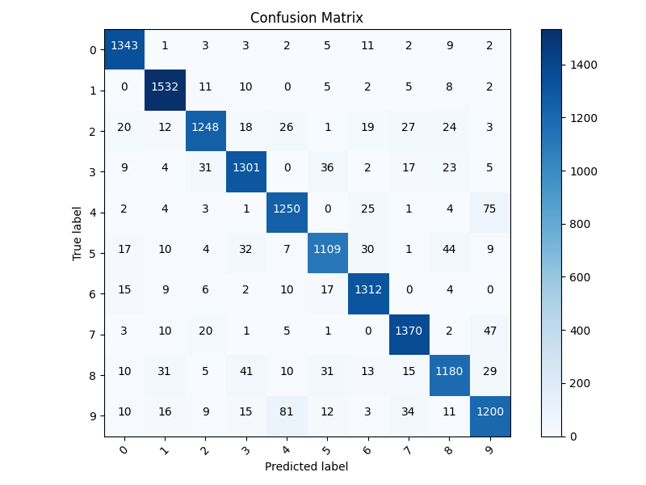
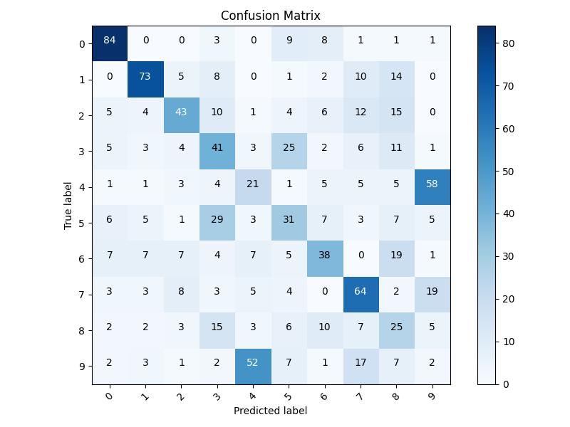
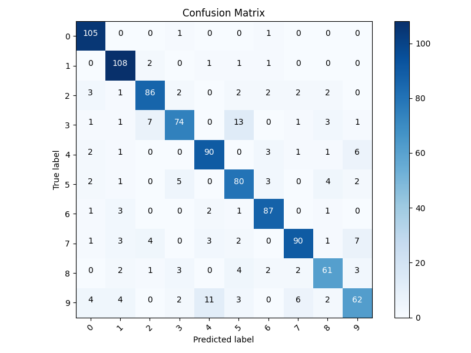

# mnist-adversarial-attacks

## Data Preparation
- Loaded the MNIST dataset using `fetch_openml`.
- Split the data into training, validation, and test sets.
- Preprocessed the data:
  - Reshaped each image to 28×28.
  - Normalized pixel values to the range [0, 1].
- Converted the data into PyTorch tensors for use with neural networks.

## Model Definition
- Implemented a convolutional neural network (`Net`) with:
  - Two convolutional layers.
  - Dropout for regularization.
  - Two fully connected layers for classification.
- Model outputs probabilities for 10 classes (digits 0–9).

## Training
- Implemented training logic using `train_loop` and `train_model`:
  - `train_loop`: Handles one epoch of training.
  - `train_model`: Orchestrates the full training process with validation after each epoch.
- Used:
  - SGD optimizer with a learning rate of 0.001 and momentum of 0.9.
  - Cross-Entropy Loss for multi-class classification.
  - Batch size of 64 for training.
- Trained the model for 10 epochs, monitoring both training and validation losses.

## Validation
- Evaluated the model after each epoch on a separate validation set.
- Logged:
  - Average validation loss.
  - Validation accuracy.

## Clean Accuracy Evaluation
- Evaluated the model's performance on the unseen test set.
- Calculated clean accuracy by comparing predictions against ground truth labels.
- **Result**: The model achieved a clean accuracy of **91.75%**.

### Implementing and Executing the PGD Attack

In this step, we implemented the **Projected Gradient Descent (PGD) attack** on a subset of 1000 test images. The purpose of this attack is to generate adversarial examples that can fool the trained model. The PGD attack iteratively perturbs the input images, while ensuring that the perturbations remain within a specified bound determined by the **L-infinity norm** (epsilon).

#### Key Hyperparameters:
- **Epsilon (eps):** The maximum perturbation allowed for each pixel, initially set to `32/255`.
- **Step size (alpha):** Set to `epsilon / 10`, which controls the amount of change in each iteration.
- **Iterations:** PGD was run for a fixed number of iterations (e.g., `50` in our case).
- **Random Restart:** The attack begins with a small random perturbation to enhance effectiveness.

#### Methodology:
1. We used the **F.cross_entropy** loss function to compute the gradients needed for the attack.
2. In each iteration, the attack updated the image in the direction that maximized the loss, constrained within the epsilon-bound.
3. After the attack, we evaluated the model's performance on these adversarial examples to determine its **robust accuracy** under the PGD attack.

#### Results:
- The clean accuracy of the model (on unperturbed test images) was **91.75%**.
- The robust accuracy of the model (on adversarial examples) dropped significantly to **42.20%** under the PGD attack, demonstrating the model's vulnerability to adversarial perturbations.

### Impact of Maximum Perturbation (Epsilon)

To evaluate the robustness of the model under different levels of perturbation, we tested the impact of varying the maximum allowable perturbation, **epsilon (eps)**. The values of epsilon used were:

- `eps = [8/255, 16/255, 32/255, 64/255]`
- The step size **alpha** was set as `alpha = eps / 10`.

#### Methodology:
1. For each epsilon, we applied the **PGD attack** to a subset of 1000 test images.
2. The robust accuracy of the model was evaluated for each level of perturbation.

#### Results:
- The robust accuracy decreased as epsilon increased, demonstrating the model's increasing vulnerability to larger perturbations.

### Visualization of Adversarial Examples

Using Matplotlib, we plotted 10 adversarial examples, each representing a unique class (0–9) from the MNIST dataset. Alongside each adversarial example, we included the corresponding original image for comparison. For both the original and adversarial images, the predicted class by the model was annotated.

#### Methodology:
1. **Original Images**: A clean image for each class was selected from the test set.
2. **Adversarial Examples**: These were generated using the **PGD attack** with parameters `eps = 32/255` and `alpha = eps/10`.
3. **Visualization**: 
   - For each class, the top row displayed the original image, and the bottom row displayed its adversarial counterpart.
   - The predicted classes for both original and adversarial images were annotated in the titles.

#### Results:
- The original images were mostly classified correctly by the model, as expected.
- Many adversarial examples successfully fooled the model, resulting in incorrect predictions.
- This visualization highlights the effectiveness of the adversarial attack and the vulnerability of the model to small perturbations.

#### Insights:
- Adversarial examples can be nearly indistinguishable from their original counterparts to the human eye, yet they significantly impact the model's performance.
- This reinforces the importance of robust training techniques, such as adversarial training, to mitigate the effect of adversarial attacks.

### Transferability of Adversarial Examples
In this section, we evaluated the transferability of adversarial examples across models with different architectures:
1. **Model 0 (CNN)**: The model used to generate adversarial examples.
2. **Model 1 (Fully Connected Network)**: A second model trained independently with the same hyperparameters as Model 0 but having a different architecture. 
   - A fully connected network was defined using three layers with ReLU activations.
   - Adversarial examples were generated for 1000 test samples using PGD on Model 0.
   - The same adversarial examples were evaluated on Model 1.
   - We calculated the **transferability ratio**, defined as the percentage of adversarial examples that fooled Model 0 and also misled Model 1.
  which is approximately **66.67%** of the adversarial examples that fooled Model 0 also misled Model 1.
- This indicates that adversarial vulnerabilities can persist across different architectures.

#### Conclusion:
- The experiment highlights that adversarial examples are not specific to a single model; they can transfer across architectures, which is concerning for deployed systems.
- **Secrecy as a Defense**:
  - Simply keeping the architecture of a model secret (e.g., in a cloud platform scenario) is insufficient to ensure its robustness against adversarial attacks.
  - Robustness should be actively built through defensive strategies like **adversarial training** or **regularization techniques** to improve resilience against adversarial attacks.

### Adversarial Training to Robustify the Model

1. Implement adversarial training for **Model Robust** using the same architecture as **Model 0 (CNN)**. 
   - Clean accuracy of Model Robust: **97.43%**

1. During training:
   - Use 3/4 of the batch for regular training.
   - Perturb the remaining 1/4 with **PGD** (10 iterations, `eps = 32/255`, `alpha = eps / 5`) and include them in training.
   - Robust accuracy of Model Robust: **84.30%**
2. Train the model for **double the number of epochs** to achieve comparable clean accuracy to Model 0.
3. Compare the **robust accuracies** of **Model 0** and **Model Robust** for varying epsilon values (`eps = [8/255, 16/255, 32/255, 64/255]`).

#### Results:
1. **Comparison of Robust Accuracies**:
   - **Model 0**:
     - Robust accuracy decreases significantly as epsilon increases, reflecting vulnerability to adversarial attacks.
   - **Model Robust**:
     - Demonstrates significantly higher robust accuracy across all epsilon values.
     - Although clean accuracy is slightly lower than Model 0, the robust accuracy shows clear improvements.
  

#### Conclusion:
Adversarial training is a valid defense, as shown by the significant improvement in robust accuracy of Model Robust compared to Model 0. However, the robustness achieved is constrained by the attacks used during training and evaluation. To enhance robustness further, training with diverse attacks and evaluating against a broader range of adversarial strategies are necessary steps.

